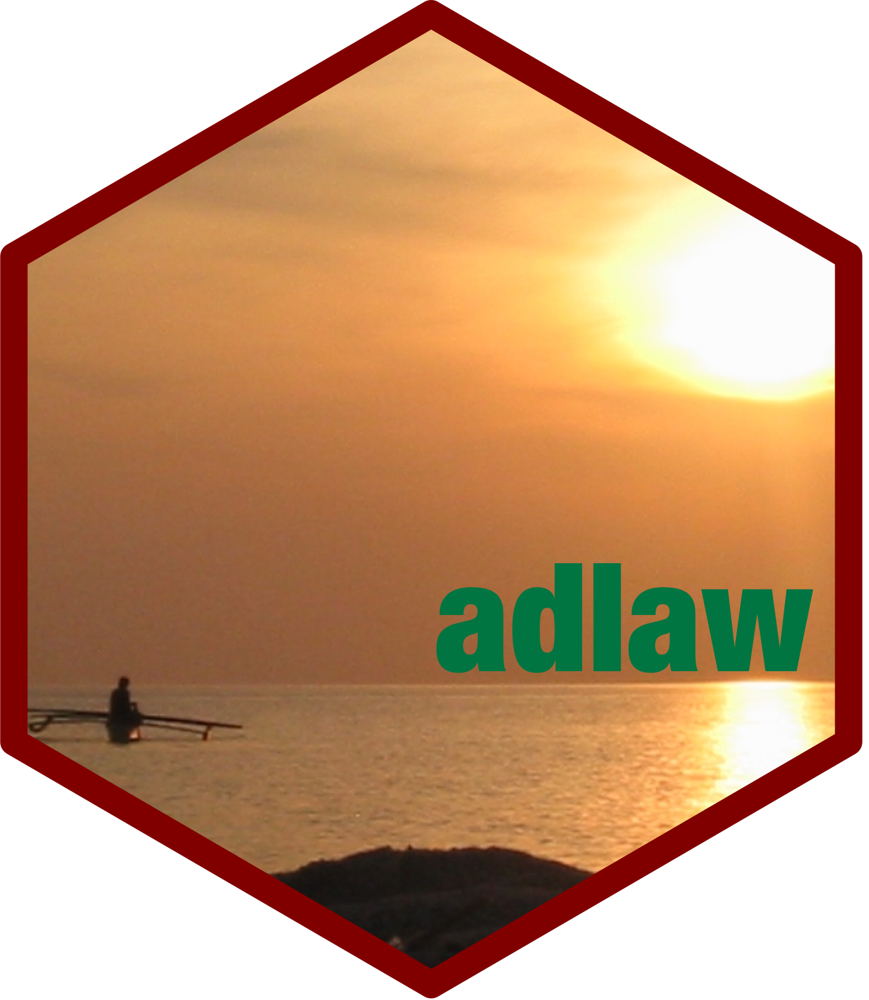

<!-- README.md is generated from README.Rmd. Please edit that file -->

# adlaw: An Interface to the Scaling Up Nutrition (SUN) Movement Datasets 

<!-- badges: start -->

[](https://www.repostatus.org/#wip)
[](https://www.tidyverse.org/lifecycle/#experimental)
[](https://github.com/katilingban/adlaw/actions/workflows/R-CMD-check.yaml)
[](https://www.codefactor.io/repository/github/katilingban/adlaw)
<!-- badges: end -->

[Scaling Up Nutrition (SUN)](http://scalingupnutrition.org) is a global
movement of 60 countries aiming to end malnutrition in all its forms.
This package contains various datasets produced by the movement and
functions that aid in the manipulation and processing of these datasets.
It also includes functions that support analysis and visualisation of
these datasets. Finally, a Shiny application is included to allow user
to interactively engage with the publicly-available SUN Movement
datasets.

## What does `adlaw` do?

## Installation

The package `adlaw` can be installed in R through GitHub via `remotes`:

``` r
if(!require(remotes)) install.packages("remotes")
remotes::install_github("katilingban/adlaw")
```

## Usage

## Citation

## Community guidelines
